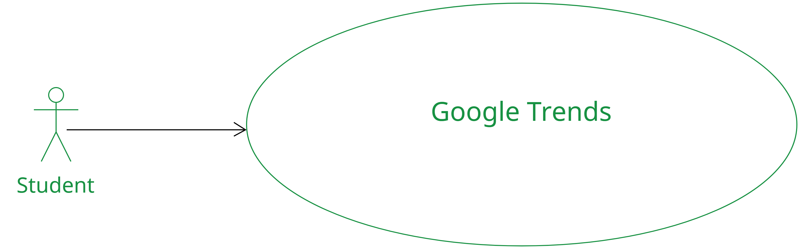
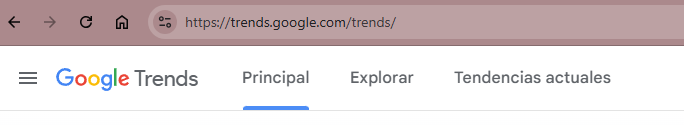
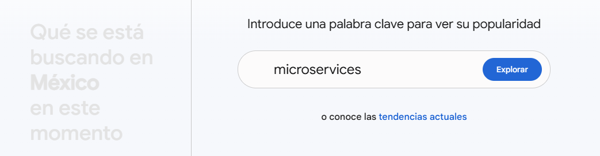
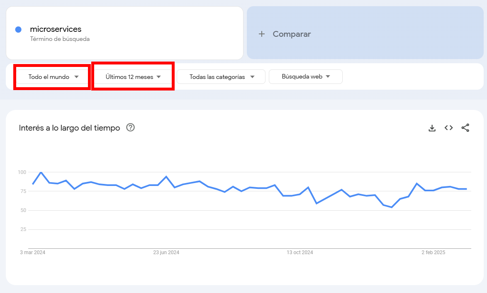
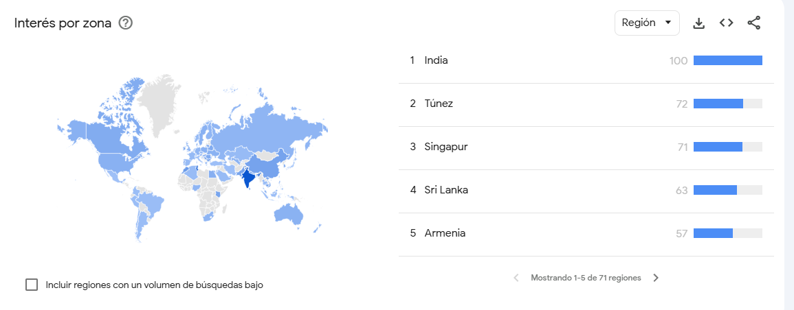
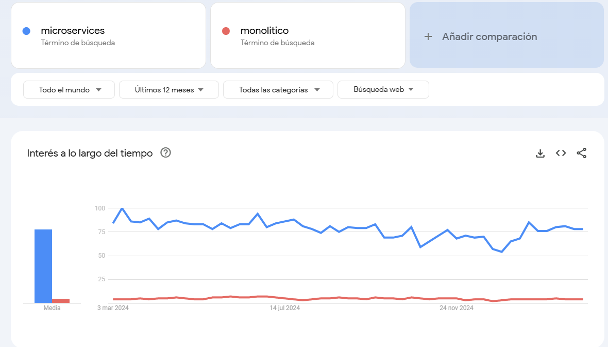
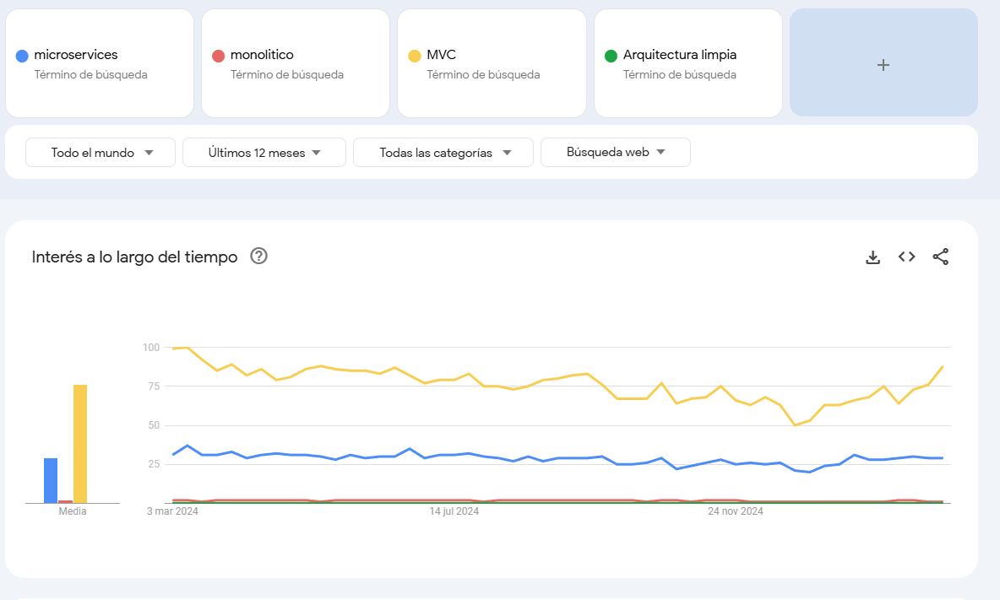

# Práctica 1. Comparación microservicios vs. monolítico

En este laboratorio se busca que el alumno pueda comparar entre los microservicios y sistemas monolíticos. 

## Objetivos de la práctica
Al terminar la siguiente práctica serás capaz de:

- Investigar el uso de los microservicios en el mundo tecnológico.
- Compararlo con los sistemas monolíticos.

## Duración aproximada:
- 30 minutos.

---
<!--Este fragmento es la barra de 
navegación-->

        <table width="50%">
            <tr>
                <td style="text-align: center;">
                    
                     anterior
                </td>
                <td style="text-align: center;">
                   <a href="../README.md">Lista Laboratorios</a>
                </td>
<td style="text-align: center;">
                    
                     siguiente
                </td>
            </tr>
        </table>

---

## Diagrama 

Se espera que el alumno realice una investigación usando Google Trends. 

## Instrucciones 

1. Abrir un explorador web **Google Chrome**, **Safari**, **Edge**, o el de su preferencia.

2. Abrir el siguiente URL: https://trends.google.com/trends/

 

3. Usar el buscador de **Google Trends**, escribir **microservices** y pulsar explorar:

4.  Por defecto mostrará las tendencias del día anterior y de la región actual. 

5. Modificar la región a **todo el mundo** y **Últimos 12 meses.**

6. Analizar los resultados y observar en que paises se usan los microservicios.

7. Hacer la comparación con un monolítico. 

> **Nota**: *A pesar que podemos observar diferencias a nivel tendencias, **recuerda que cada herramienta se usa en escenarios diferentes***

8. Agregar en la comparativa otras arquitecturas. 

# Resultado esperado

Se espera que el alumno pueda observar un gráfico cómo el siguiente: 

