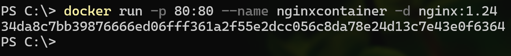

# Práctica 2. Contenedor nginx
En este laboratorio se busca crear un contenedor con un servidor nginx para probar la infraestructura que usaremos en contenedores. 


## Objetivos
- Comprender la configuración de Docker.
- Usar comandos para crear un contenedor con nginx.
- Explorar las herramientas. 

## Duración aproximada:
-  30 minutos.

---
<div style="width: 400px;">
        <table width="50%">
            <tr>
                <td style="text-align: center;">
                    <a href="../Capitulo1/"></a>
                    <br>anterior
                </td>
                <td style="text-align: center;">
                   <a href="../README.md">Lista Laboratorios</a>
                </td>
<td style="text-align: center;">
                    <a href="../Capitulo3/">
                    </a>
                    <br>siguiente
                </td>
            </tr>
        </table>
</div>

---


## Diagrama


<br>

> **IMPORTANTE:** *Para realizar este laboratorio es necesario tener instalado Docker, en el caso de que no sea así, visitar el siguiente URL: [docker installation](https://docs.docker.com/desktop/setup/install/windows-install/)* y seguir las instrucciones de instalación


## Instrucciones

### Configuración de contenedor nginx

1. Abrir una terminal dentro de un servidor que tenga Docker instalado. 

2. Validar que Docker este instalado con el comando: 

```bash
docker version
```

3. Descargar la imagen de nginx.

```bash
docker pull nginx:1.24
```


4. Crear un contenedor con nginx instalado exponiendo el puerto 80.

```bash
docker run -p 80:80 --name nginxcontainer -d nginx:1.24
```



5. Validar que el contenedor este iniciado usando el comando:

```bash
docker ps
```


> **NOTA:** *El comando **docker ps** sólo muestra los contenedores iniciados*


6. Abrir un explorador web y escribir: http://localhost


## Resultado esperado

Se espera que el alumno pueda observar su contenedor iniciado y a nginx ejecutandose en el puerto 80.

