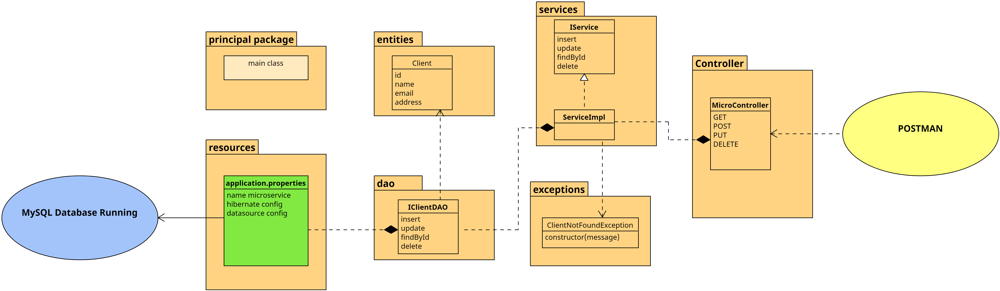
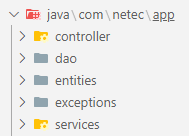
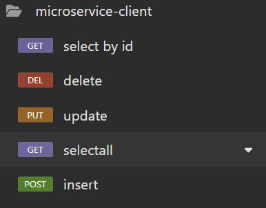

# Práctica 3. Microservicio cliente
Desarrollar un microservicio que permita la administración de clientes. 

## Objetivos de la práctica
Al terminar la siguiente práctica serás capaz de:

- Desarrollar un microservicio usando Spring Boot.
- Definir buenas prácticas al desarrollar el microservicio.
- Probar el microservicio en Insomnia, Postman ó curl.

## Duración aproximada:
-  60 minutos.

---

<div style="width: 400px;">
        <table width="50%">
            <tr>
                <td style="text-align: center;">
                    <a href="../Capitulo2/"></a>
                    <br>anterior
                </td>
                <td style="text-align: center;">
                   <a href="https://netec-mx.github.io/MICR_DEV/">Lista Laboratorios</a>
                </td>
<td style="text-align: center;">
                    <a href="../Capitulo4/"></a>
                    <br>siguiente
                </td>
            </tr>
        </table>
</div>

---


## Diagrama




## Instrucciones
Este laboratorio esta separado en la siguientes secciones:

- **[Desarrollar microservicio cliente](#desarrollar-microservicio-cliente-return)**
- **[Probar microservicio](#probar-microservicio-return)**

## Desarrollar microservicio cliente [return](#instrucciones)
1. Crear un nuevo proyecto **Spring Boot App** con la siguiente configuración:
   
- group: com.netec
- languaje: Java
- type: maven
- Java version: 17
- packaging: Jar
- Version: 1.0.0
- Description: microservice client

2. Agregar las siguientes dependencias: 

- Spring web
- Spring Boot Dev Tools
- Spring Data JPA
- MySQLDriver

3. Crear los siguientes paquetes en el paquete principal 



4. En el paquete entities crear la clase **Client.java** y añadir el siguiente código. 

```java
package com.netec.app.entities;

import jakarta.persistence.Column;
import jakarta.persistence.Entity;
import jakarta.persistence.GeneratedValue;
import jakarta.persistence.GenerationType;
import jakarta.persistence.Id;
import jakarta.persistence.Table;

@Entity
@Table(name="clients")
public class Client {
	@Id
	@GeneratedValue(strategy = GenerationType.IDENTITY)
	private long id;
	@Column(length=50)
	private String name;
	@Column(length=100)
	private String email;
	@Column(length=150)
	private String address;
	public long getId() {
		return id;
	}
	public void setId(long id) {
		this.id = id;
	}
	public String getName() {
		return name;
	}
	public void setName(String name) {
		this.name = name;
	}
	public String getEmail() {
		return email;
	}
	public void setEmail(String email) {
		this.email = email;
	}
	public String getAddress() {
		return address;
	}
	public void setAddress(String address) {
		this.address = address;
	}
	
	
}
```

5. En el paquete **dao** añadir una interface llamada **IClientDAO** y añadir el siguiente código:

```java
package com.netec.app.dao;

import org.springframework.data.repository.CrudRepository;

import com.netec.app.entities.Client;

public interface IClientDAO extends CrudRepository<Client, Long> {

}
```

6. En el paquete **exceptions**, añadir la clase **ClientNotExistsException.java**. Después, añadir el siguiente código: 

```java
package com.netec.app.exceptions;

public class ClientNotExistsException extends RuntimeException {
	private static final long serialVersionUID = 1L;
	
	public ClientNotExistsException(String message) {
		super(message);
	}
}
```

7. Añadir una interface en el paquete services y una clase que llamaremos **IService.java** y **ServiceImpl**.
    
**IService.java**
```java
package com.netec.app.services;

import java.util.List;

import com.netec.app.entities.Client;

public interface IService {
	boolean insert(Client cl);
	boolean update(Client cl);
	boolean deleteById(long id);
	List<Client> findAll();
	Client findById(long id);
}
```

**ServiceImpl.java**
```java
package com.netec.app.services;

import java.util.List;

import org.springframework.beans.factory.annotation.Autowired;
import org.springframework.stereotype.Service;

import com.netec.app.dao.IClientDAO;
import com.netec.app.entities.Client;
import com.netec.app.exceptions.ClientNotExistsException;

@Service
public class ServiceImpl implements IService{
	@Autowired
	private IClientDAO dao;

	@Override
	public boolean insert(Client cl) {
		var result=dao.save(cl);
		
		return result!=null;
	}

	@Override
	public boolean update(Client cl) {
		
		if(dao.existsById(cl.getId())) {
			var result=dao.save(cl);
			return result!=null;
		}
		
		throw new ClientNotExistsException("Client "+cl.getId()+" doesn't exist");
	}

	@Override
	public boolean deleteById(long id) {
		if(dao.existsById(id)) {
			dao.deleteById(id);
			return true;
		}
		
		throw new ClientNotExistsException("Client "+id+" doesn't exist");
	}

	@Override
	public List<Client> findAll() {
		return (List<Client>) dao.findAll();
	}

	@Override
	public Client findById(long id) {
		
		return dao.findById(id)
				.orElseThrow(()-> new ClientNotExistsException("Client "+id+" doesn´t exist"));
	}
}
```

8. En el paquete **controller**, añadir una clase llamada **MicroController.java** y el siguiente código.

```java
package com.netec.app.controller;

import java.util.List;

import org.slf4j.Logger;
import org.slf4j.LoggerFactory;
import org.springframework.beans.factory.annotation.Autowired;
import org.springframework.http.HttpStatus;
import org.springframework.http.ResponseEntity;
import org.springframework.web.bind.annotation.DeleteMapping;
import org.springframework.web.bind.annotation.GetMapping;
import org.springframework.web.bind.annotation.PathVariable;
import org.springframework.web.bind.annotation.PostMapping;
import org.springframework.web.bind.annotation.PutMapping;
import org.springframework.web.bind.annotation.RequestBody;
import org.springframework.web.bind.annotation.RequestMapping;
import org.springframework.web.bind.annotation.RequestParam;
import org.springframework.web.bind.annotation.RestController;

import com.netec.app.entities.Client;
import com.netec.app.exceptions.ClientNotExistsException;
import com.netec.app.services.IService;

@RestController
@RequestMapping("/client")
public class MicroserviceController {
	private static final Logger LOGGER=LoggerFactory.getLogger(MicroserviceController.class);
	@Autowired
	private IService service;
	
	@PostMapping
	public ResponseEntity<String> insert(@RequestBody Client cl){
		if(service.insert(cl)) {
			return new ResponseEntity<>("client inserted", HttpStatus.CREATED);
		}
		
		return new ResponseEntity<String>("error", HttpStatus.BAD_REQUEST);
	}
	
	@GetMapping
	public ResponseEntity<List<Client>> selectAll(){
		return new ResponseEntity<>(service.findAll(), HttpStatus.OK);
	}
	
	@DeleteMapping
	public ResponseEntity<String> deleteById(@RequestParam long id){
	
		try{
			if(service.deleteById(id))
				return new ResponseEntity<String>("client deleted", HttpStatus.OK);
			
		}catch(ClientNotExistsException ex) {
			return new ResponseEntity<String>("client doesn't exist", HttpStatus.NOT_FOUND);
			
		}catch(Exception ex) {
			LOGGER.warn("ERROR DELETE {}", ex.getMessage());
		}
		return new ResponseEntity<String>("internal error", HttpStatus.INTERNAL_SERVER_ERROR);
	}	
	
	
	@PutMapping
	public ResponseEntity<String> update(@RequestBody Client cl){
		try {
			if(service.update(cl))
				return new ResponseEntity<String>("updated client", HttpStatus.OK);
			
		}catch(ClientNotExistsException ex) {
			LOGGER.info(ex.getMessage());
			return new ResponseEntity<String>(ex.getMessage(), HttpStatus.NOT_FOUND);
		}catch(Exception ex) {
			LOGGER.warn(ex.getMessage());
		}
		
		return new ResponseEntity<String>("internal error", HttpStatus.INTERNAL_SERVER_ERROR);
	}
	
	@GetMapping("/{id}")
	public ResponseEntity<Client> selectById(@PathVariable long id){
		try {
			
			return new ResponseEntity<Client>(service.findById(id),HttpStatus.OK);
			
		}catch(ClientNotExistsException ex) {
			LOGGER.info(ex.getMessage());
			return new ResponseEntity<>(HttpStatus.NOT_FOUND);
		}catch(Exception ex) {
			LOGGER.warn(ex.getMessage());
		}
		return new ResponseEntity<>(HttpStatus.INTERNAL_SERVER_ERROR);
		
	}

}

```

9. Añadir la siguiente configuración en el archivo **application.properties**:

```properties
spring.application.name=micro-client
server.port=8081

#hibernate config
spring.jpa.properties.hibernate.dialect=org.hibernate.dialect.MySQLDialect
spring.jpa.hibernate.ddl-auto=update

#config datasource
spring.datasource.url=jdbc:mysql://${IP_DB:localhost}:3306/${NAME_DB:micro1}
spring.datasource.username=${USER_DB:root}
spring.datasource.password=${PASSWORD_DB:1234}
```

10. Ejecutar la aplicación. **Hacer clic derecho en proyecto**->**RunAs**-> **SpringBootApp**


## Probar el microservicio [return](#instrucciones)

1. Abrir insomnia y probar las siguientes operaciones: 

- **POST**:

```bash
curl --request POST \
  --url http://localhost:8081/client \
  --header 'Content-Type: application/json' \
  --header 'User-Agent: insomnia/10.3.1' \
  --data '{
	"name":"daniela",
	"email":"daniela.nvf@gmail.com",
	"address":"su otra casa"
}'
```

- **GET**

```bash
curl --request GET \
  --url http://localhost:8081/client \
  --header 'User-Agent: insomnia/10.3.1'
```

- **UPDATE**

```bash
curl --request PUT \
  --url http://localhost:8081/client \
  --header 'Content-Type: application/json' \
  --header 'User-Agent: insomnia/10.3.1' \
  --data '{
		"id": 3,
		"name": "zaira",
		"email": "zaira@gmail.com",
		"address": "su nueva casa"
	}'
```


- **DELETE**:

```bash
curl --request DELETE \
  --url 'http://localhost:8081/client?id=3' \
  --header 'User-Agent: insomnia/10.3.1'
```

- **SELECT BY ID**

```bash
curl --request GET \
  --url http://localhost:8081/client/6 \
  --header 'User-Agent: insomnia/10.3.1'
```

## Resultado esperado 


Se espera que el alumno pruebe todas las operaciones del microservicios en insomnia, al finalizar debería de tener una carpeta con todas las operaciones. 




---

<div style="width: 400px;">
        <table width="50%">
            <tr>
                <td style="text-align: center;">
                    <a href="../Capitulo2/"></a>
                    <br>anterior
                </td>
                <td style="text-align: center;">
                   <a href="https://netec-mx.github.io/MICR_DEV/">Lista Laboratorios</a>
                </td>
<td style="text-align: center;">
                    <a href="../Capitulo4/"></a>
                    <br>siguiente
                </td>
            </tr>
        </table>
</div>

---
