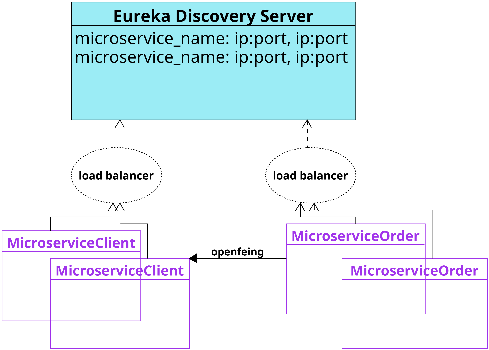
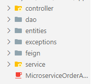
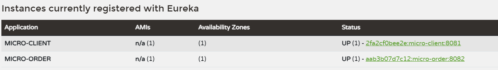

# Práctica 4. Comunicación entre microservicios y balanceo de cargas OpenFeing y Eureka

Crear un microservicio **order** que nos permita administrar las ordenes de pago. Para la creación de este laboratorio es necesario el microservicio **Cliente** del **[capitulo 3](../Capitulo3/README.md)**


## Objetivos de la práctica
Al terminar la siguiente práctica serás capaz de:

- Crear microservicio **order** que nos permita conectarnos a **cliente.**
- Implementar **Feign Client** para extraer información de otro microservicio.
- Usar el servicio de descubrimiento **eureka** para registrar las instancias de los microservicios. 
- Probar los microservicios.

## Duración aproximada:
-  90 minutos.

---

<div style="width: 400px;">
        <table width="50%">
            <tr>
                <td style="text-align: center;">
                    <a href="../Capitulo3/"></a>
                    <br>anterior
                </td>
                <td style="text-align: center;">
                   <a href="https://netec-mx.github.io/MICR_DEV/">Lista Laboratorios</a>
                </td>
<td style="text-align: center;">
                    <a href="../Capitulo5/"></a>
                    <br>siguiente
                </td>
            </tr>
        </table>
</div>

---

## Diagrama



>**IMPORTANTE**: Para este laboratorio necesitamos el microservicio del **Capitulo 3**, en caso de no tenerlo, regresar al laboratorio anterior. 

## Instrucciones
Este laboratorio esta separado en las siguientes secciones.

- **[Implementar order con openfeign]()**

- **[Implementar eureka con client y order]()**

### Implementar order con openfeign [instrucciones](#instrucciones)
1. Crear un nuevo proyecto de Spring **File->New->Spring Starter Project.**

2. Añadir la siguiente configuración:

- group: com.netec
- languaje: Java
- type: maven
- Java version: 17
- packaging: Jar
- Version: 1.0.0
- Description: microservice order

3. Agregar las siguientes dependencias: 

- Spring web
- Spring Boot Dev Tools
- Spring Data JPA
- MySQLDriver
- OpenFeign

4. Añadir la siguiente configuración en el archivo **applicaction.properties**:

```properties
spring.application.name=micro-order
server.port=8082

#hibernate config
spring.jpa.properties.hibernate.dialect=org.hibernate.dialect.MySQLDialect
spring.jpa.hibernate.ddl-auto=update

#datasource config
spring.datasource.url=jdbc:mysql://${IP_DB:localhost}:3306/${NAME_DB:micro2}
spring.datasource.username=${USER_DB:root}
spring.datasource.password=${PASS_DB:1234}
```

5. En el proyecto añadir la siguiente estructura de paquetes.



6. En la clase principal del proyecto colocar la siguiente anotación: 

```java
@EnableFeignClients
```

7. El código de la clase principal quedaría de la siguiente forma: 

```java
package com.netec.app;

import org.springframework.boot.SpringApplication;
import org.springframework.boot.autoconfigure.SpringBootApplication;
import org.springframework.cloud.openfeign.EnableFeignClients;

@EnableFeignClients
@SpringBootApplication
public class MicroserviceOrderApplication {

	public static void main(String[] args) {
		SpringApplication.run(MicroserviceOrderApplication.class, args);
	}

}
```

8. En el paquete **entities** añadir las clases:
- Client.java
- Order.java

**Client.java**
```java
package com.netec.app.entities;

public class Client {
	private long id;
	private String name;
	private String email;
	private String address;
	public long getId() {
		return id;
	}
	public void setId(long id) {
		this.id = id;
	}
	public String getName() {
		return name;
	}
	public void setName(String name) {
		this.name = name;
	}
	public String getEmail() {
		return email;
	}
	public void setEmail(String email) {
		this.email = email;
	}
	public String getAddress() {
		return address;
	}
	public void setAddress(String address) {
		this.address = address;
	}

}
```

**Order.java**
```java
package com.netec.app.entities;

import java.time.LocalDate;

import jakarta.persistence.Column;
import jakarta.persistence.Entity;
import jakarta.persistence.GeneratedValue;
import jakarta.persistence.GenerationType;
import jakarta.persistence.Id;
import jakarta.persistence.Table;

@Entity
@Table(name="orders")
public class Order {
	@Id
	@GeneratedValue(strategy = GenerationType.IDENTITY)
	private long id;
	private double total;
	@Column(length=100)
	private String emailClient;
	@Column(length=150)
	private String addressClient;
	private LocalDate date;
	
	
	public LocalDate getDate() {
		return date;
	}
	public void setDate(LocalDate date) {
		this.date = date;
	}
	public long getId() {
		return id;
	}
	public void setId(long id) {
		this.id = id;
	}
	public double getTotal() {
		return total;
	}
	public void setTotal(double total) {
		this.total = total;
	}
	public String getEmailClient() {
		return emailClient;
	}
	public void setEmailClient(String emailClient) {
		this.emailClient = emailClient;
	}
	public String getAddressClient() {
		return addressClient;
	}
	public void setAddressClient(String addressClient) {
		this.addressClient = addressClient;
	}	
}
```

9. En el paquete **dao** añadir una interface que llamaremos **IOrderDAO**.

```java
package com.netec.app.dao;

import org.springframework.data.repository.CrudRepository;

import com.netec.app.entities.Order;

public interface IOrderDAO extends CrudRepository<Order, Long>{

}
```

10. En el paquete **feign** añadiremos una interface que llamaremos **IClientFeign**.

```java
package com.netec.app.feign;

import org.springframework.cloud.openfeign.FeignClient;
import org.springframework.web.bind.annotation.GetMapping;
import org.springframework.web.bind.annotation.PathVariable;

import com.netec.app.entities.Client;

@FeignClient(name="micro-client", url="localhost:8081/client")
public interface IClientFeign {

	@GetMapping("/{id}")
	Client selectById(@PathVariable long id);

}
```

11. En el paquete **exceptions** añadiremos 2 clases:
- ClientNotExistsException.java
- OrderNotExistsException.java

**ClientNotExistsException**
```java
package com.netec.app.exceptions;

public class ClientNotExistsException extends RuntimeException{
	private static final long serialVersionUID = 1L;
	
	public ClientNotExistsException(String message) {
		super(message);
	}
}
```


**OrderNotExistsException**
```java
package com.netec.app.exceptions;

public class OrderNotExistsException extends RuntimeException {
	private static final long serialVersionUID = 1L;
	
	public OrderNotExistsException(String message) {
		super(message);
	}
}
```

12. En el paquete **services** añadiremos una clase y una interface.
- IService.java (*interface*)
- ServiceImpl.java (*clase*)

**IService**
```java
package com.netec.app.service;

import java.util.List;

import com.netec.app.entities.Order;

public interface IService {
	
	boolean insertOrder(double total, long idClient);
	List<Order> selectAll();
	boolean deleteById(long id);
}

```

**ServiceImpl**
```java
package com.netec.app.service;

import java.time.LocalDate;
import java.util.List;

import org.springframework.beans.factory.annotation.Autowired;
import org.springframework.stereotype.Service;
import com.netec.app.dao.IOrderDAO;
import com.netec.app.entities.Order;
import com.netec.app.exceptions.ClientNotExistsException;
import com.netec.app.exceptions.OrderNotExistsException;
import com.netec.app.feign.IClientFeign;

import feign.FeignException.NotFound;

@Service
public class ServiceImpl implements IService{
	@Autowired
	private IClientFeign feign;
	
	@Autowired
	private IOrderDAO dao;
	

	@Override
	public boolean insertOrder(double total, long idClient) {
		try {
			var result=feign.selectById(idClient);
			var order=new Order();
			order.setAddressClient(result.getAddress());
			order.setEmailClient(result.getEmail());
			order.setDate(LocalDate.now());
			order.setTotal(total);
			
			var insertResult=dao.save(order);
			
			return insertResult!=null; 
			
		}catch(NotFound ex) {
			throw new ClientNotExistsException("Client "+idClient+" doesn't exists");
		}
	}


	@Override
	public List<Order> selectAll() {
		
		return (List<Order>)dao.findAll();
	}


	@Override
	public boolean deleteById(long id) {
		if(dao.existsById(id)) {
			dao.deleteById(id);
			return true;
		}
			
		throw new OrderNotExistsException("Order "+id+" doesn't exist");
	}

}
```

13. En el paquete **controller** añadiremos una clase llamada **MicroController.java**

```java
package com.netec.app.controller;

import java.util.List;

import org.slf4j.Logger;
import org.slf4j.LoggerFactory;
import org.springframework.beans.factory.annotation.Autowired;
import org.springframework.http.HttpStatus;
import org.springframework.http.ResponseEntity;
import org.springframework.web.bind.annotation.DeleteMapping;
import org.springframework.web.bind.annotation.GetMapping;
import org.springframework.web.bind.annotation.PostMapping;
import org.springframework.web.bind.annotation.RequestMapping;
import org.springframework.web.bind.annotation.RequestParam;
import org.springframework.web.bind.annotation.RestController;

import com.netec.app.entities.Order;
import com.netec.app.exceptions.ClientNotExistsException;
import com.netec.app.exceptions.OrderNotExistsException;
import com.netec.app.service.IService;

@RestController
@RequestMapping("/order")
public class MicroController {
	private static final Logger LOGGER=LoggerFactory.getLogger(MicroController.class);
	
	@Autowired
	private IService service;
	
	@PostMapping
	public ResponseEntity<String> insert(@RequestParam double total, @RequestParam long id){
	   try {
		     if(service.insertOrder(total, id))
		    	 return new ResponseEntity<>("order inserted", HttpStatus.CREATED);
		    			 
	   }catch(ClientNotExistsException ex) {
		   LOGGER.info(ex.getMessage());
		   return new ResponseEntity<>("client doesn't exists ", HttpStatus.NOT_FOUND);
	   }catch(Exception ex) {
		   LOGGER.warn(ex.getMessage());
		   
	   }
	   return new ResponseEntity<>("internal error", HttpStatus.INTERNAL_SERVER_ERROR);
	   
	}
	
	@GetMapping
	public ResponseEntity<List<Order>> selectAll(){
		return new ResponseEntity<List<Order>>(service.selectAll(), HttpStatus.OK);
	}
	
	
	@DeleteMapping
	public ResponseEntity<String> delete(@RequestParam long id){
		try {
			if(service.deleteById(id))
				return new ResponseEntity<>("order deleted", HttpStatus.OK);
			
		}catch(OrderNotExistsException ex) {
			LOGGER.info(ex.getMessage());
			return new ResponseEntity<String>("order doesn´t exist", HttpStatus.NOT_FOUND);
		}catch(Exception ex) {
			LOGGER.warn(ex.getMessage());
		}
		return new ResponseEntity<String>("internal error", HttpStatus.INTERNAL_SERVER_ERROR);
	}

}
```

14. Iniciar el microservicio **Order**. 
> **IMPORTANTE:** Para probar el microservicio order se debe tener iniciado el microservicio client. 


15. Probar los siguientes métodos de HTTP en Insmonia, Postman ó curl.

- **POST**
```bash
curl --request POST \
  --url 'http://localhost:8082/order?total=500&id=7' \
  --header 'User-Agent: insomnia/10.3.1'
```

- **GET**
```bash
curl --request GET \
  --url http://localhost:8082/order \
  --header 'User-Agent: insomnia/10.3.1'
```

- **DELETE**

```bash
curl --request DELETE \
  --url 'http://localhost:8082/order?id=3' \
  --header 'User-Agent: insomnia/10.3.1'
```


### Implementar eureka con client y order [instrucciones](#instrucciones).

1. Crear un nuevo proyecto de Spring Boot **File->New->Spring Starter Project**.

2. Añadir la siguiente información:

- group: com.netec
- languaje: Java
- type: maven
- Java version: 17
- packaging: Jar
- Version: 1.0.0
- Description: microservice eureka

3. Añadir las siguientes dependencias:

- Spring Boot DevTools
- Eureka Server
- Spring Web

4. En el archivo **application.properties** añadir la siguiente configuración:

```properties
spring.application.name=micro-eureka
server.port=9999

#disable client
eureka.client.register-with-eureka=false
eureka.client.fetch-registry=false

eureka.server.max-threads-for-peer-replication=0
```

5. En la clase principal añadir la siguiente anotación:

```java
@EnableEurekaServer
```
6. La clase principal quedaría de la siguiente forma: 

```java
package com.netec.app;

import org.springframework.boot.SpringApplication;
import org.springframework.boot.autoconfigure.SpringBootApplication;
import org.springframework.cloud.netflix.eureka.server.EnableEurekaServer;

@EnableEurekaServer
@SpringBootApplication
public class MicroserviceEurekaApplication {

	public static void main(String[] args) {
		SpringApplication.run(MicroserviceEurekaApplication.class, args);
	}

}
```

7. Configuración de **MicroserviceClient.**

    1. En el archivo **pom.xml** añadir la siguiente dependencia:

        ```xml
        <dependency>
            <groupId>org.springframework.cloud</groupId>
            <artifactId>spring-cloud-starter-netflix-eureka-client</artifactId>
        </dependency>
        ```
    2. En el archivo **application.properties** añadir la siguiente línea al final del archivo. 
        ```properties
        #eureka config
        eureka.client.service-url.defaultZone=http://localhost:9999/eureka
        ```
    
    3. Reiniciar el microservicio.

8. Configuración de **MicroserviceOrder.**

    1. En el archivo **pom.xml** añadir la siguiente dependencia:
        ```xml
        <dependency>
            <groupId>org.springframework.cloud</groupId>
            <artifactId>spring-cloud-starter-netflix-eureka-client</artifactId>
        </dependency>
        ```
    2. En el archivo **application.properties** añadir la siguiente configuración al final del archivo:
        ```properties
        #eureka discovery
        eureka.client.service-url.defaultZone=http://localhost:9999/eureka
        ```
    3. Al modificar **IClientFeign** quedaría de la siguiente forma:
        ```java
        package com.netec.app.feign;

        import org.springframework.cloud.openfeign.FeignClient;
        import org.springframework.web.bind.annotation.GetMapping;
        import org.springframework.web.bind.annotation.PathVariable;

        import com.netec.app.entities.Client;

        @FeignClient(name="micro-client")
        public interface IClientFeign {

            @GetMapping("/client/{id}")
            Client selectById(@PathVariable long id);

        }

        ```
    4. Reiniciar el microservicio


## Resultado esperado 
Cuando finalize el laboratorio se espera que el alumno pueda observar sus microservicios client y order registrados en eureka. 




---

<div style="width: 400px;">
        <table width="50%">
            <tr>
                <td style="text-align: center;">
                    <a href="../Capitulo3/"></a>
                    <br>anterior
                </td>
                <td style="text-align: center;">
                   <a href="https://netec-mx.github.io/MICR_DEV/">Lista Laboratorios</a>
                </td>
<td style="text-align: center;">
                    <a href="../Capitulo5/"></a>
                    <br>siguiente
                </td>
            </tr>
        </table>
</div>

---
