# Práctica 5. Arquitectura completa microservicios
Se requiere que el alumno implemente todos los servicios vistos en el tema 5. 
Spring Cloud Gateway, Spring Config, Spring Security, Resilience4j

## Objetivos de la práctica
Al terminar la siguiente práctica serás capaz de:

- Implementar Resilience4j.
- Implementar Spring config.
- Implementar Spring Cloud Gateway.
- Implementar Spring Security.

## Duración aproximada:
- 240 minutos.


---
<div style="width: 400px;">
        <table width="50%">
            <tr>
                <td style="text-align: center;">
                    <a href="../Capitulo4/"></a>
                    <br>anterior
                </td>
                <td style="text-align: center;">
                   <a href="https://netec-mx.github.io/MICR_DEV/">Lista Laboratorios</a>
                </td>
<td style="text-align: center;">
                   <a href="../Capitulo6/"></a>
                    <br>siguiente
                </td>
            </tr>
        </table>
</div>

---

> **IMPORTANTE:** Para este laboratorio es importante realizar el laboratorio 4 y tener tus microservicios registrados en eureka. 


## Diagrama

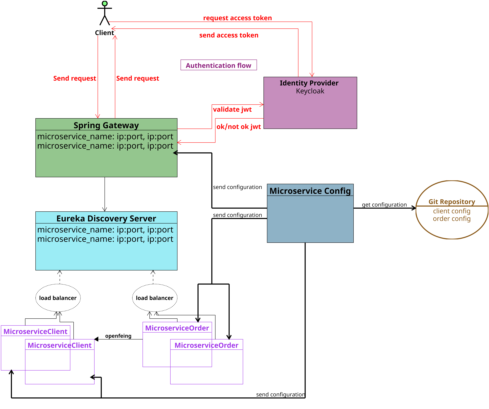


## Instrucciones
Este laboratorio esta dividido en las siguientes secciones.

- **[Resilience4j configuración](#resilience4j-configuración-return)**
- **[Spring Gateway](#spring-gateway-return)**
- **[Security](#security-return)**
- **[Spring Config](#spring-config-return)**

### Resilience4j Configuración [return](#instrucciones)
> **NOTA:** Se recomienda implementar circuit breaker en los microservicios que dependan de otros microservicios. 

1. En el microservicio **Order** añadir en el **pom.xml** la siguiente dependencia.

```xml
<dependency>
	<groupId>org.springframework.cloud</groupId>
	<artifactId>spring-cloud-starter-circuitbreaker-resilience4j</artifactId>
</dependency>
```
3. Modificar la clase **ServiceImpl.java** que se encuentra en el paquete **services** con el siguiente código:

```java
package com.netec.app.service;

import java.time.LocalDate;
import java.util.List;

import org.slf4j.Logger;
import org.slf4j.LoggerFactory;
import org.springframework.beans.factory.annotation.Autowired;
import org.springframework.cloud.client.circuitbreaker.CircuitBreakerFactory;
import org.springframework.stereotype.Service;
import com.netec.app.dao.IOrderDAO;
import com.netec.app.entities.Order;
import com.netec.app.exceptions.ClientNotExistsException;
import com.netec.app.exceptions.OrderNotExistsException;
import com.netec.app.feign.IClientFeign;

import feign.FeignException.NotFound;

@Service
public class ServiceImpl implements IService{
	private static final Logger LOGGER= LoggerFactory.getLogger(ServiceImpl.class);
	
	@Autowired
	private IClientFeign feign;
	
	@Autowired
	private IOrderDAO dao;
	
	@Autowired
	private CircuitBreakerFactory<?,?> cb;
	

	@Override
	public boolean insertOrder(double total, long idClient) {
		return cb.create("circuit1")
				.run(()->{
					try {
						var result=feign.selectById(idClient);
						var order=new Order();
						order.setAddressClient(result.getAddress());
						order.setEmailClient(result.getEmail());
						order.setDate(LocalDate.now());
						order.setTotal(total);
						
						var insertResult=dao.save(order);
						
						return insertResult!=null; 
						
					}catch(NotFound ex) {
						throw new ClientNotExistsException("Client "+idClient+" doesn't exists");
					}
					
				}, error-> fallbackMethod(total, idClient, error));
	}
	
	private boolean fallbackMethod(double total, long idClient, Throwable error) {
		
		LOGGER.warn("EJECUTANDO CAMINO ALTERNATIVO!!!!");
		if(error instanceof ClientNotExistsException) {
			throw (ClientNotExistsException)error;
		}
		
		LOGGER.warn("ERROR NO ESPERADO {}", error.getMessage());
		
		return false;
	}


	@Override
	public List<Order> selectAll() {
		
		return (List<Order>)dao.findAll();
	}


	@Override
	public boolean deleteById(long id) {
		if(dao.existsById(id)) {
			dao.deleteById(id);
			return true;
		}
			
		throw new OrderNotExistsException("Order "+id+" doesn't exist");
	}

}

```

4. En el paquete principal, agregar una nueva clase a la que llamaremos **ConfigResilienceCustom**. Después, añadir el siguiente código:

```java
package com.netec.app;

import java.time.Duration;

import org.springframework.cloud.circuitbreaker.resilience4j.Resilience4JCircuitBreakerFactory;
import org.springframework.cloud.circuitbreaker.resilience4j.Resilience4JConfigBuilder;
import org.springframework.cloud.client.circuitbreaker.Customizer;
import org.springframework.context.annotation.Bean;
import org.springframework.context.annotation.Configuration;

import com.netec.app.exceptions.ClientNotExistsException;

import io.github.resilience4j.circuitbreaker.CircuitBreakerConfig;

@Configuration
public class ConfigResilienceCustom {
	@Bean
	public Customizer<Resilience4JCircuitBreakerFactory> configuration(){
		
		return factory -> factory.configureDefault(id ->{
			if(id.equals("circuit1")) {
				return new Resilience4JConfigBuilder(id)
						.circuitBreakerConfig(
								CircuitBreakerConfig.custom()
								.slidingWindowSize(10)
								.failureRateThreshold(50)
								.waitDurationInOpenState(Duration.ofSeconds(10L))
								.permittedNumberOfCallsInHalfOpenState(5)
								.ignoreExceptions(ClientNotExistsException.class)
								.build()
								).build();
						
			}
			
			return null;
		});
	}
}
```

5. Guardar todo


### Spring Gateway [return](#instrucciones)

1. Crear un nuevo Spring starter Project.

2. Añadir la siguiente configuración: 

- group: com.netec
- languaje: Java
- type: maven
- Java version: 17
- packaging: Jar
- Version: 1.0.0
- Description: microservice gateway

3. Añadir las siguientes dependencias:

- Spring Boot DevTools
- Reactive Gateway
- Eureka Discovery Client

4. En el archivo **application.properties** añadir la siguiente configuración: 

```properties
spring.application.name=micro-gateway
server.port=8888

#config eureka
eureka.client.service-url.defaultZone=http://localhost:9999/eureka

#config eureka
spring.cloud.gateway.discovery.locator.enabled=false
spring.cloud.gateway.discovery.locator.lower-case-service-id=true

#routes
spring.cloud.gateway.routes[0].id=micro-client
spring.cloud.gateway.routes[0].uri=lb://micro-client
spring.cloud.gateway.routes[0].predicates[0]=Path=/api1/**
spring.cloud.gateway.routes[0].filters[0]=StripPrefix=1

spring.cloud.gateway.routes[1].id=micro-order
spring.cloud.gateway.routes[1].uri=lb://micro-order
spring.cloud.gateway.routes[1].predicates[0]=Path=/api2/**
spring.cloud.gateway.routes[1].filters[0]=StripPrefix=1

logging.level.org.springframework.cloud.gateway=DEBUG
logging.level.reactor.netty.http.client=DEBUG
```

5. Guardar todo.


### Security [return](#instrucciones)
1. Para este laboratorio se necesita que **Docker este instalado e iniciado.**

2. Abrir una terminal y ejecutar el siguiente comando:

```bash
docker run -p 80:8080 --name idp -e KEYCLOAK_PASSWORD=pass -e KEYCLOAK_USER=admin -e PROXY_ADDRESS_FORWARDING=true -d edgardovefe/clase_seguridad:keycloak
```

> **NOTA**: El comando anterior inicia un contenedor con **Keycloak** y lo expone por el 
puerto 80. 

> **IMPORTANTE**: El usuario configurado es **admin** y el password es **pass**.

3. Abrir un nuevo explorador web y escribir la siguiente ruta: http://localhost:80, abrirá la siguiente pantalla:


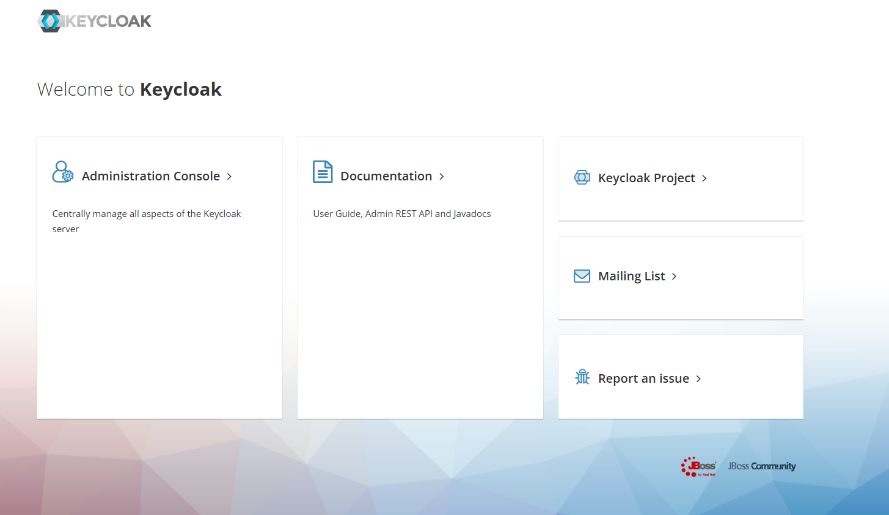

4. Seleccionar **Administration Console.**

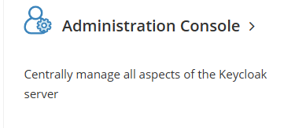

5. Le pedirá usuario y contraseña, **recuerde**:
- **user**: admin
- **password**: pass

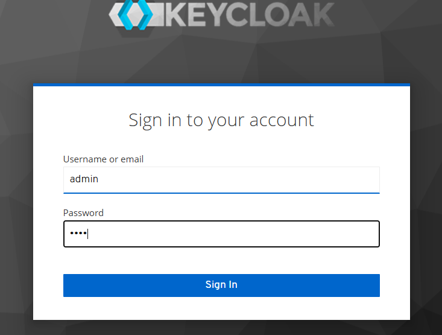


6. Crear un Realm (Conocido cómo dominio de usuarios).

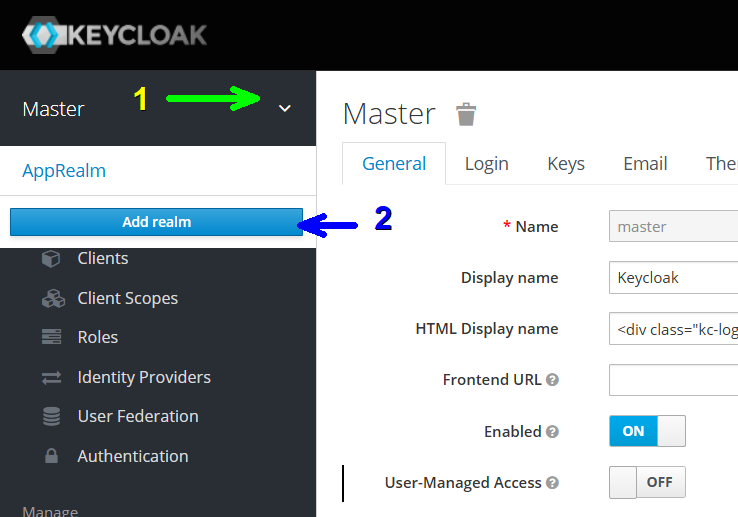


7. Poner como nombre del Realm **netec** (puede cambiar el nombre, pero es importante que lo **recuerde**). 

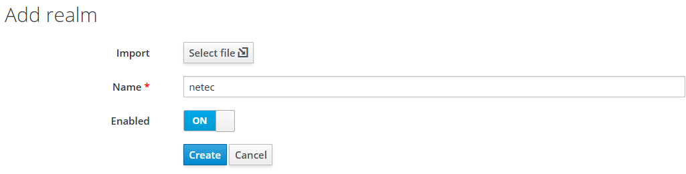


8. Crear un cliente.

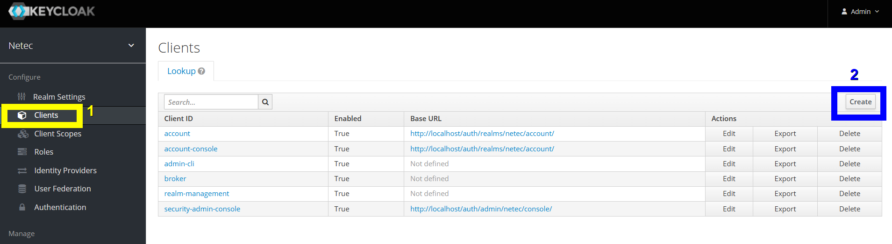

9. Configuración de cliente:
- **Client ID**: myclient
- **Client Procotol**: openid-connect

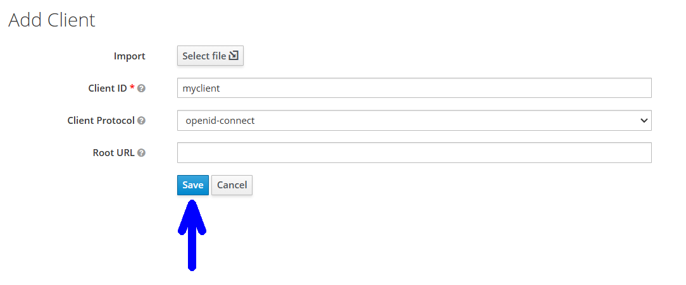

10. Configuramos el URL del **MicroservicieClient** en el cliente **myclient**->**settings**:

- **Valid Redirect URIs**: http://localhost:8084/*

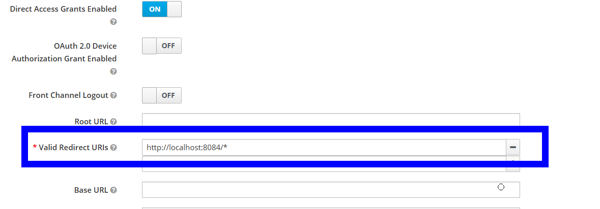

11. **(Opcional)** Cambiar la duración del access token a 30 min o menos (si no se cambia la duración cada token sólo podrá usarse una vez) **myclient**->**settings**->**Advanced Settings**

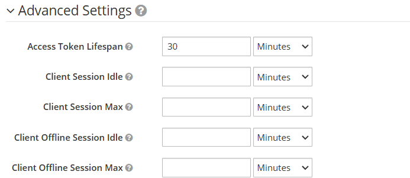

12. Crear usuario. 

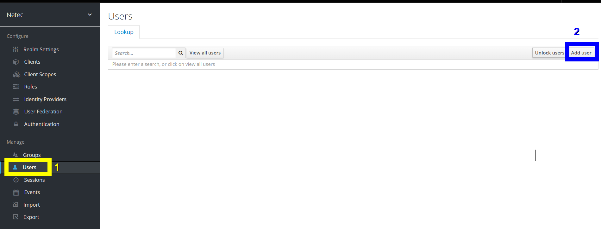

13. Datos usuarios:
- **Username**: user1:
- **Email**: user1@test.com

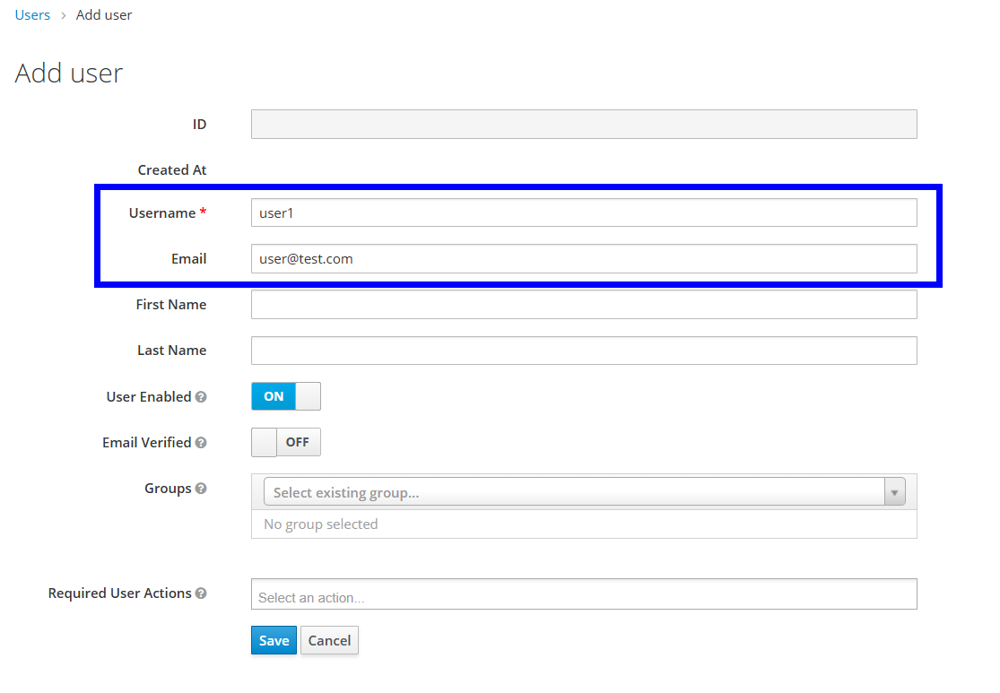

14. Agregar credenciales al usuario, añadir **123456**.

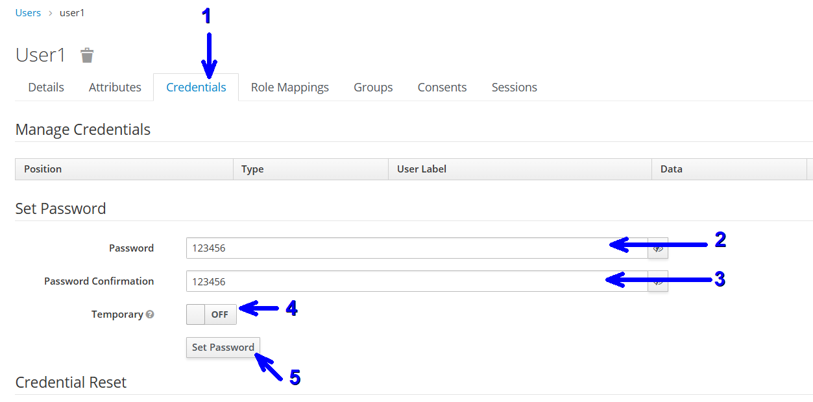

15. Extraemos la información necesaria para Spring boot **Realm Settings**->**Endpoints**->**OpenID Endpoint Configuration**

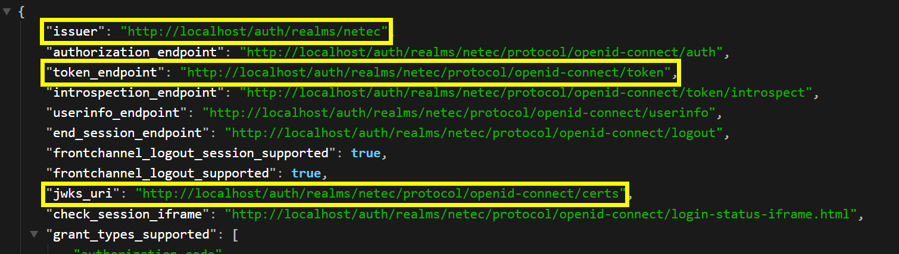

**Explicación de cada endpoint**
- **issuer**: Endpoint necesario para la conexión de keycloak con spring boot.

- **jwks_uri**: Contiene las llaves publicas para verificar el JWT, también es necesario para spring boot.

- **token_endpoint**: Es usado para obtener los access tokens de los usuarios, este lo usa el cliente. 

16 En el microservicio **Gateway** añadir la siguiente dependencia:

```xml
<dependency>
	<groupId>org.springframework.boot</groupId>
    <artifactId>spring-boot-starter-oauth2-resource-server</artifactId>
</dependency>
```
17. En el paquete principal del gateway crear 2 clases **SecurityConfig** y **LogUsernameFilter.**

**Securityconfig**
```java
package com.netec.app;

import org.springframework.context.annotation.Bean;
import org.springframework.context.annotation.Configuration;
import org.springframework.security.config.Customizer;
import org.springframework.security.config.annotation.web.reactive.EnableWebFluxSecurity;
import org.springframework.security.config.web.server.ServerHttpSecurity;
import org.springframework.security.web.server.SecurityWebFilterChain;

@Configuration
@EnableWebFluxSecurity
public class SecurityConfig {

    @Bean
    public SecurityWebFilterChain securityWebFilterChain(ServerHttpSecurity http) {
        http
            .authorizeExchange(exchanges -> exchanges
                .anyExchange().authenticated()  // Requerir autenticación en todas las rutas
            )
            .oauth2ResourceServer(oauth2 -> oauth2.jwt(Customizer.withDefaults())); // Usar JWT de Keycloak

        return http.build();
    }
}
```

**LogUsernameFilter**
```java
package com.netec.app;

import org.slf4j.Logger;
import org.slf4j.LoggerFactory;
import org.springframework.security.core.Authentication;
import org.springframework.security.core.context.ReactiveSecurityContextHolder;
import org.springframework.security.oauth2.jwt.Jwt;
import org.springframework.stereotype.Component;
import org.springframework.web.server.ServerWebExchange;
import org.springframework.web.server.WebFilter;
import org.springframework.web.server.WebFilterChain;

import reactor.core.publisher.Mono;

@Component
public class LogUsernameFilter implements WebFilter {

    private static final Logger logger = LoggerFactory.getLogger(LogUsernameFilter.class);

    @Override
    public Mono<Void> filter(ServerWebExchange exchange, WebFilterChain chain) {
    	return ReactiveSecurityContextHolder.getContext()
    			.flatMap(securityContext->{
    				Authentication auth= securityContext.getAuthentication();
    				if(auth != null && auth.isAuthenticated() ) {
    					
    					if(auth.getPrincipal() instanceof Jwt) {
    						String username=((Jwt)auth.getPrincipal()).getClaim("preferred_username");
    						logger.info("Usuario autenticado: {}", username);	
    					}
    					
    				}else {
    					logger.info("Usuario no autenticado");
    				}
    				
    				return chain.filter(exchange);
    			}).switchIfEmpty(chain.filter(exchange));
    }
   
}
```

18. En el archivo **application.properties** añadir la configuración del identity provider.

```properties
server.port=8888

#config eureka
eureka.client.service-url.defaultZone=http://${IP_EUREKA:localhost}:9999/eureka

#config eureka
spring.cloud.gateway.discovery.locator.enabled=false
spring.cloud.gateway.discovery.locator.lower-case-service-id=true

#config keycloak oauth server
spring.security.oauth2.resourceserver.jwt.issuer-uri=${ISSUER_URI:http://localhost/auth/realms/netec}
spring.security.oauth2.resourceserver.jwt.jwk-set-uri=${JWK_URI:http://localhost/auth/realms/netec/protocol/openid-connect/certs}

#routes
spring.cloud.gateway.routes[0].id=micro-client
spring.cloud.gateway.routes[0].uri=lb://micro-client
spring.cloud.gateway.routes[0].predicates[0]=Path=/api1/**
spring.cloud.gateway.routes[0].filters[0]=StripPrefix=1

spring.cloud.gateway.routes[1].id=micro-order
spring.cloud.gateway.routes[1].uri=lb://micro-order
spring.cloud.gateway.routes[1].predicates[0]=Path=/api2/**
spring.cloud.gateway.routes[1].filters[0]=StripPrefix=1

logging.level.org.springframework.cloud.gateway=DEBUG
logging.level.reactor.netty.http.client=DEBUG
```

19. Guardar todo.


### Spring Config [return](#instrucciones)

1. Crear una nueva carpeta en el escritorio que llamaremos **repositorio.**

2. Abrir una terminal en la carpeta repositorio y ejecutar el comando:

```bash
git init
```

3. Añadir 3 archivo con la siguiente sintaxis **namemicroservice.properties.**

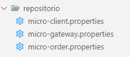

4. En cada archivo añadir el contenido de los archivos **application.properties** de cada microservicio con excepción del nombre. 

5. Ejecutar los comandos para confirmar los cambios en el repositorio.

```bash
git add .
git commit -m "config files"
```

6. Crear un nuevo proyecto **Spring starter project** con la siguiente configuración: 

- group: com.netec
- languaje: Java
- type: maven
- Java version: 17
- packaging: Jar
- Version: 1.0.0
- Description: microservice config

7. Añadir las siguientes dependencias:

- Spring Boot DevTools
- Config Server

8. Añadir la siguiente configuración en el archivo **application.properties**

```properties
spring.application.name=micro-config
server.port=7777

#config repository
spring.cloud.config.server.git.uri=file:///C:/Users/egar2/Desktop/material/repositorio
```

9. En la clase principal añadir la siguiente anotación:

```java
@EnableConfigServer
```

10. Guardar todo.

11. Configuración **MicroserviceClient**, **Microservice Gateway** y **MicroserviceOrder.**

12. Añadir la siguiente dependencia a los 3 microservicios.

```xml
<dependency>
	<groupId>org.springframework.cloud</groupId>
	<artifactId>spring-cloud-starter-config</artifactId>
</dependency>
```

13. En su archivo **application.properties** de cada microservicio eliminar toda su configuración con excepción del nombre. Y añadir la siguiente línea para que pueda extraer la configuración del servidor. 

```properties
spring.config.import=optional:configserver:http://${IP_CONFIGSERVER:localhost}:7777
```

**ejemplo: application.properties MicroserviceClient**
```properties
spring.application.name=micro-client
spring.config.import=optional:configserver:http://${IP_CONFIGSERVER:localhost}:7777
```

> **IMPORTANTE:** Se tiene que realizar en los 3 microservicios. 


14. Guardar todo.


## Resultado esperado [Instrucciones](#instrucciones)

Si se ha llegado hasta aquí se deben de seguir los siguientes pasos para probar nuestra arquitectura:

1. Iniciar los microservicios en este orden:
   
- **Contenedor idp**
- **MicroserviceConfig**
- **MicroserviceEureka**
- **MicroserviceClient**
- **MicroserviceOrder**
- **MicroserviceGateway**

2. Obtener el token de Keycloak con el siguiente comando:

```bash
curl --request POST \
  --url http://localhost/auth/realms/netec/protocol/openid-connect/token \
  --header 'Content-Type: application/x-www-form-urlencoded' \
  --header 'User-Agent: insomnia/10.3.1' \
  --data client_id=myclient \
  --data grant_type=password \
  --data username=user1 \
  --data password=123456
```

3. Copiar el **access token.**

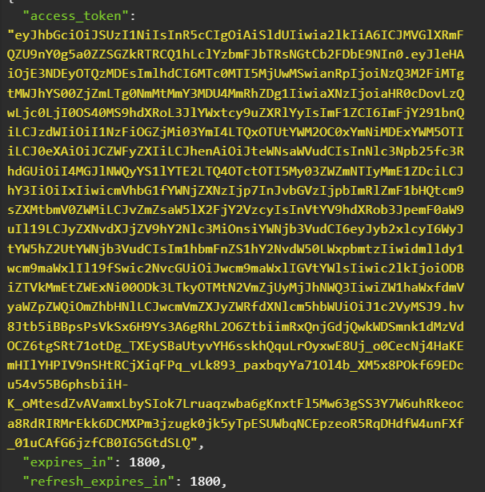

4. Probar el acceso a nuestro microservicios desde el gateway, en cada request se enviará el **access token.**

- **POST Order**
```bash
curl --request POST \
  --url 'http://localhost:8888/api2/order?total=400&id=1' \
  --header 'Authorization: Bearer <access_token>' \
  --header 'User-Agent: insomnia/10.3.1'
```

- **POST Client**
```bash
curl --request POST \
  --url http://localhost:8888/api1/client \
  --header 'Authorization: Bearer <access_token>' \
  --header 'Content-Type: application/json' \
  --header 'User-Agent: insomnia/10.3.1' \
  --data '{
	"name":"Edgardo",
	"email":"ed@gmail.com",
	"address":"su casa en xochimilco"
}'
```

## Resultado esperado

5. Se espera que al final el alumno pueda tener acceso a su arquitectura de microservicios. 

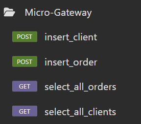


---

<div style="width: 400px;">
        <table width="50%">
            <tr>
                <td style="text-align: center;">
                    <a href="../Capitulo3/"></a>
                    <br>anterior
                </td>
                <td style="text-align: center;">
                   <a href="https://netec-mx.github.io/MICR_DEV/">Lista Laboratorios</a>
                </td>
<td style="text-align: center;">
                    <a href="../Capitulo5/"></a>
                    <br>siguiente
                </td>
            </tr>
        </table>
</div>

---
