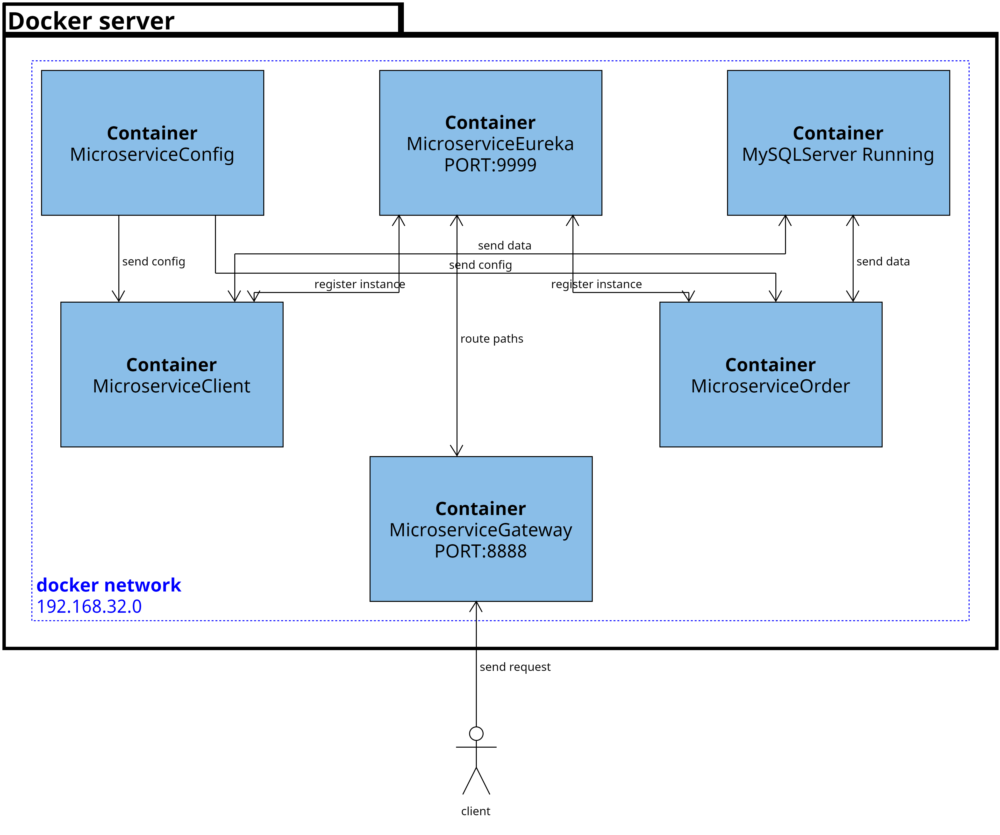
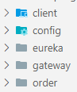
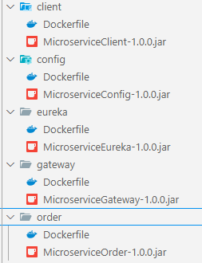
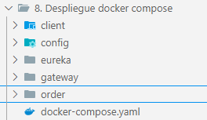
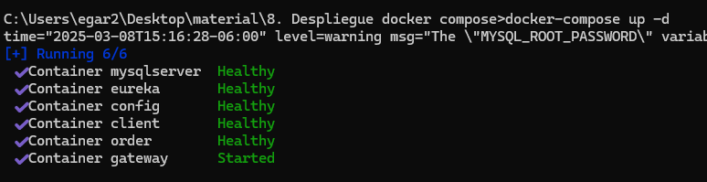
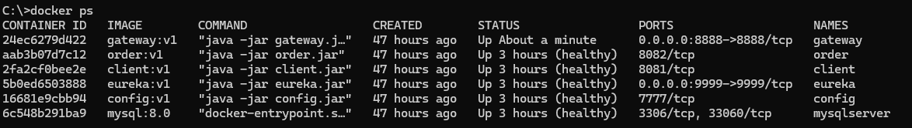

# Práctica 6.Despliegue de arquitectura completa
Se requiere que el alumno despliegue en contenedores su sarquitectura de microservicios.  

## Objetivos
- Crear las imagenes de sus microservicios.
- Crear contenedores para validar el funcionamiento.
- Crear un archivo de orquestación para iniciar toda su arquitectura.

## Duración aproximada:
-  60 minutos.

---

<div style="width: 400px;">
        <table width="50%">
            <tr>
                <td style="text-align: center;">
                    <a href="../Capitulo5/"></a>
                    <br>anterior
                </td>
                <td style="text-align: center;">
                   <a href="../README.md">Lista Laboratorios</a>
                </td>
<td style="text-align: center;">
                    <a href="../Capitulo6/"></a>
                    <br>siguiente
                </td>
            </tr>
        </table>
</div>

---


## Diagrama



## Instrucciones
Este laboratorio se separa en las siguientes secciones:

- **[Crear imagenes docker]()**
- **[Crear docker-compose]()**

### Crear imagenes docker [return](#instrucciones)
> **IMPORTANTE**: Subir la configuración de tus microservicios a un repositorio cómo GitHub o Bitbucket. 

1. Para cada microservicio se debe de generar su jar, sólo se le debe de dar **Click derecho-> Run As->maven install** 

> **IMPORTANTE:** Para generar el jar de cada microservicio deben estar iniciados **MicroserviceConfig** y **MicroserviceEureka.** 

2. Crear una estructura de carpetas en una carpeta llamada **deploy**.
   Vamos a crear las siguientes carpetas. 



3. En cada una de las carpetas debes añadir el **jar** generado de cada microservicio. Debería quedar de la siguiente forma:



4. En cada carpeta añadir un archivo llamado **Dockerfile** y añadir el siguiente contenido en cada uno:

**Dockerfile Client**
```Dockerfile
FROM openjdk:17
WORKDIR /app
COPY MicroserviceClient-1.0.0.jar client.jar
EXPOSE 8081
ENTRYPOINT [ "java","-jar","client.jar" ] 
```

**Dockerfile Config**
```Dockerfile
FROM openjdk:17
WORKDIR /app
COPY MicroserviceConfig-1.0.0.jar config.jar
EXPOSE 7777
ENTRYPOINT [ "java","-jar", "config.jar" ]
```
**Dockerfile eureka**
```Dockerfile
FROM openjdk:17
WORKDIR /app
COPY MicroserviceEureka-1.0.0.jar eureka.jar
EXPOSE 9999
ENTRYPOINT [ "java","-jar","eureka.jar" ]
```
**Dockerfile gateway**
```Dockerfile
FROM openjdk:17
WORKDIR /app
COPY MicroserviceGateway-1.0.0.jar gateway.jar
EXPOSE 8888
ENTRYPOINT [ "java","-jar","gateway.jar" ]
```

**Dockerfile order**
```Dockerfile
FROM openjdk:17
WORKDIR /app
COPY MicroserviceOrder-1.0.0.jar order.jar
EXPOSE 8082
ENTRYPOINT [ "java","-jar","order.jar" ]
```

5. Guardar todo.


### Crear docker-compose [return](#instrucciones)
1. En la raíz de la carpeta donde se encuentran las carpetas de los **jars** correspondientes de los microservicios, añadiremos un archivo que llamaremos **docker-compose.yaml**.



2. En el archivo **docker-compose.yaml** añadir el siguiente contenido:

```yaml
services:

  mysqlserver:
    container_name: mysqlserver
    image: "mysql:8.0"
    networks:
      - microservices
    environment:
      - MYSQL_ROOT_PASSWORD=netec123
      - MYSQL_DATABASE=app
    healthcheck:
      test: mysqladmin -uroot -p${MYSQL_ROOT_PASSWORD} ping -h localhost
      
  config:
    container_name: config
    build: ./config
    image: config:v1
    networks:
      - microservices
    environment:
      - URI_REPOSITORY=https://github.com/EdgardoVelasco/configmicros.git
    healthcheck:
      test: curl -f http://localhost:7777/micro-client/default
  
  eureka:
    container_name: eureka
    build: ./eureka
    image: eureka:v1
    networks:
      - microservices
    ports:
      - 9999:9999
    healthcheck:
      test: curl -f http://localhost:9999
  
  client:
    container_name: client
    build: ./client
    image: client:v1
    networks:
      - microservices
    depends_on:
      config:
        condition: service_healthy
      eureka:
        condition: service_healthy
      mysqlserver:
        condition: service_healthy
    environment:
      - IP_CONFIGSERVER=config
      - IP_DB=mysqlserver
      - NAME_DB=app
      - USER_DB=root
      - PASSWORD_DB=netec123
      - IP_EUREKA=eureka
    healthcheck:
      test: curl -f http://localhost:8081/client
  
  order:
    container_name: order
    build: ./order
    image: order:v1
    networks:
      - microservices
    depends_on:
      client:
        condition: service_healthy
      config:
        condition: service_healthy
      eureka:
        condition: service_healthy
      mysqlserver:
        condition: service_healthy

    environment:
      - IP_CONFIGSERVER=config
      - IP_DB=mysqlserver
      - NAME_DB=app
      - USER_DB=root
      - PASS_DB=netec123
      - IP_EUREKA=eureka
    healthcheck:
      test: curl -f http://localhost:8082/order
    
  gateway:
    container_name: gateway
    build: ./gateway
    image: gateway:v1
    networks:
      - microservices
    ports:
      - 8888:8888
    depends_on:
      config:
        condition: service_healthy
      client:
        condition: service_healthy
      order:
        condition: service_healthy
    environment:
      - IP_CONFIGSERVER=config
      - IP_EUREKA=eureka
      - ISSUER_URI=http://40.74.249.41/auth/realms/netec
      - JWK_URI=http://40.74.249.41/auth/realms/netec/protocol/openid-connect/certs
    

networks:
  microservices:
    ipam:
      driver: default
      config:
        - subnet: 192.168.32.0/24
          gateway: 192.168.32.1


```

3. Abrir una terminal en la ruta del archivo **docker-compose.yaml** y ejecutar el siguiente comando: 

```bash
docker-compose up -d
```

4. Esperar a que nos muestre una salida similar a la siguiente: 




## Resultado esperado [Instrucciones](#instrucciones)
Se espera que el alumno pueda observar todos sus proyectos iniciados en contenedores de Docker con un sólo comando:



